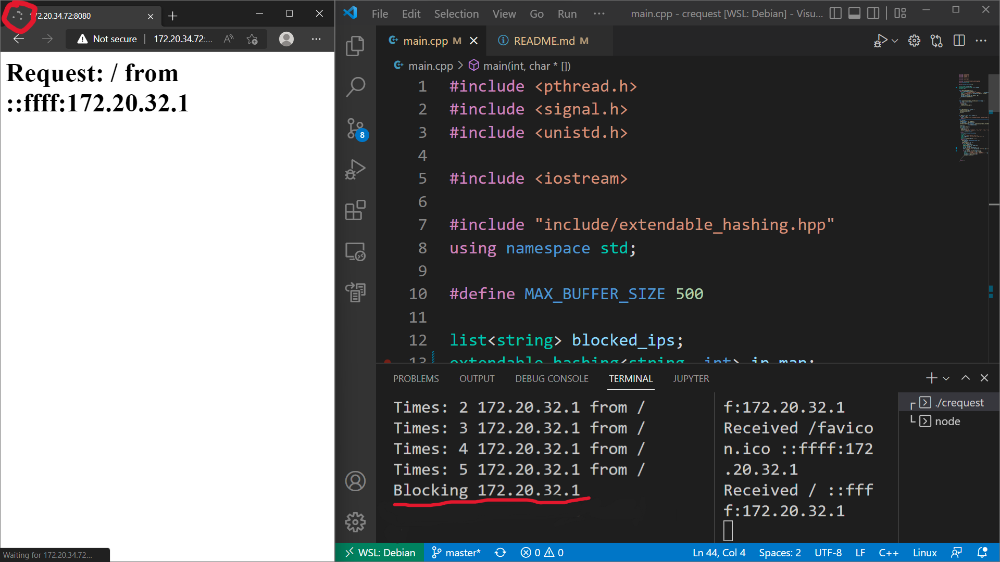

<div align="center">
 
</div>

[](https://GitHub.com/Muthu-Palaniyappan-OL/crequest/commit/)
[](https://GitHub.com/Muthu-Palaniyappan-OL/crequest/releases/)
[](https://GitHub.com/Muthu-Palaniyappan-OL/crequest/stargazers/)


<!-- TABLE OF CONTENTS -->
<details>
  <summary>Table of Contents</summary>
  <ol>
    <li>
      <a href="#about-the-project">About The Project</a>
      <ul>
        <li><a href="#built-with">Built With</a></li>
      </ul>
    </li>
    <li>
      <a href="#getting-started">Getting Started</a>
      <ul>
        <li><a href="#prerequisites">Prerequisites</a></li>
        <li><a href="#installation">Installation</a></li>
      </ul>
    </li>
    <li><a href="#usage">Usage</a></li>
    <li><a href="#contributing">Contributing</a></li>
    <li><a href="#license">License</a></li>
    <li><a href="#contact">Contact</a></li>
  </ol>
</details>


<!-- ABOUT THE PROJECT -->
## About The Project

This project is based on C++ which focus on limiting the number of HTTP requests sent to linux server in a window time. Bad players could send enormous amount of requests to a linux server to stop the system from servering its normal clients. To prevent this kind of attack (DoS) from happening a this project is created to hel you host you website in linux servers. This project is framework independant (Depends only on linux) so you can attach this to any of your stack easily.   

<div align="center">
 
</div>

If you take a look at this image after a paticular request limit inside the window time the application blocks the client's access to the linux server.

### Built With

* [C++](https://isocpp.org/)


## Getting Started

./crequest port-number window-time request-limit

Building The Project From Scratch
```sh
chmod +x blacklist
make
./crequest 8080 10 5
```

### Prerequisites

* make
* g++ (10.2.1-6 >= )
* linux system (Which supports iptables-legacy)

### Installation

```sh
chmod +x blacklist
make
./crequest 8080 10 5
mv ./crequest ~/.local/bin
```

## Usage

./crequest port-number window-time request-limit

## Contributing

Contributions are what make the open source community such an amazing place to learn, inspire, and create. Any contributions you make are **greatly appreciated**.

If you have a suggestion that would make this better, please fork the repo and create a pull request. You can also simply open an issue with the tag "enhancement".
Don't forget to give the project a star! Thanks again!

1. Fork the Project
2. Create your Feature Branch (`git checkout -b feature/AmazingFeature`)
3. Commit your Changes (`git commit -m 'Add some AmazingFeature'`)
4. Push to the Branch (`git push origin feature/AmazingFeature`)
5. Open a Pull Request


## License

Distributed under the GPL2 License. See `LICENSE.txt` for more information.


## Contact

Muthu Palaniyappan OL - [@iampalaniyappan](https://twitter.com/iampalaniyappan) - [mail me](mailto:muthu892542@gmail.com)

Edumba Vannia Raja T - [@iampalaniyappan](https://twitter.com/iampalaniyappan) - [mail me](mailto:muthu892542@gmail.com)

Srinikethan S - [@iampalaniyappan](https://twitter.com/iampalaniyappan) - [mail me](mailto:muthu892542@gmail.com)

Project Link: [https://github.com/Muthu-Palaniyappan-OL/crequest](https://github.com/Muthu-Palaniyappan-OL/crequest)